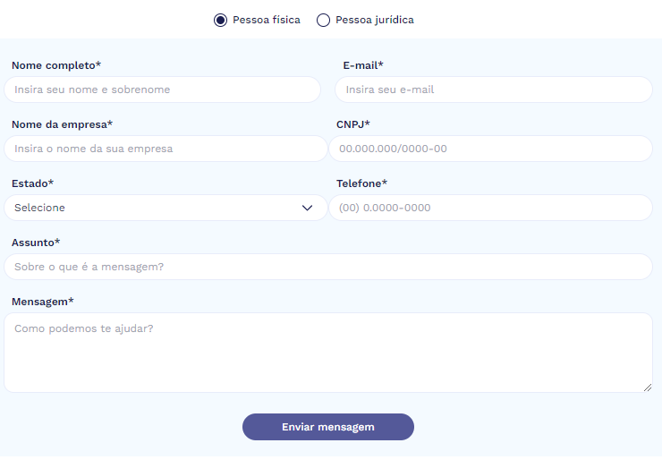

# Exemplo de formulário e JavaScript de envio na plataforma Wake Commerce - StoreFront 

Este repositório contém um exemplo de formulário em HTML e JavaScript, estilizado com Tailwind CSS. 

## Funcionalidades

- **Envio de Formulário**: Função JavaScript para envio dos dados do formulário.
- **Máscaras de Input**:
  - Telefone
  - CNPJ
- **Botão Rádio Personalizado**: Customização de botões rádio utilizando JavaScript e Tailwind CSS.
 
## Como Utilizar

1. **Criar o Formulário**:
   - No painel, navegue até **Vitrines > Conteúdos**.
   - Crie um conteúdo e insira o código HTML disponível em 'formulario-para-ser-inserido-em-conteudos-no-painel.html'.

2. **Adicione o JS na sua página**:
   - Disponível em 'envioform.js'. 

3. **Estilização com Tailwind CSS**:
   - O formulário é estilizado usando classes do Tailwind CSS, seguindo o padrão de temas da Wake Commerce.

## Documentação

Para mais informações sobre a utilização do Tailwind CSS, consulte:

- [Documentação do Tailwind CSS](https://tailwindcss.com/docs) 

## Contribuição

Contribuições são bem-vindas! Sinta-se à vontade para abrir um Pull Request ou relatar problemas.
